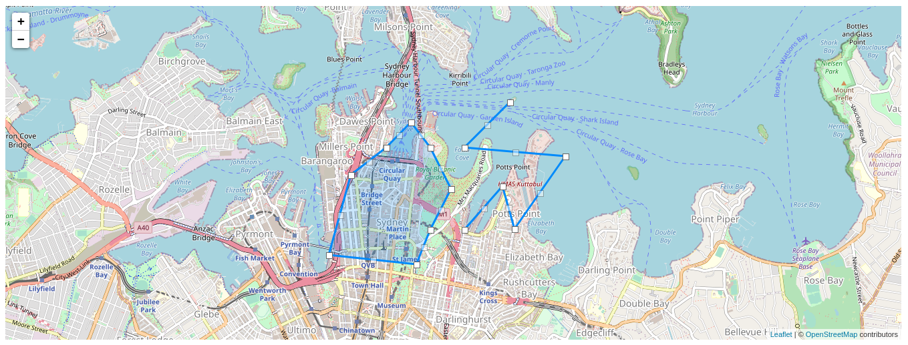

# vue2-leaflet-editable

This is a [Leaflet.Editable plugin](https://github.com/Leaflet/Leaflet.Editable) extension for [vue2-leaflet package](https://github.com/KoRiGaN/Vue2Leaflet)



## Install

```
npm install --save vue2-leaflet-editable
# or
yarn add vue2-leaflet-editable
```

### Demo

Check out the [live demo](http://vue2-leaflet-editable.geopan.io/) or run the following:

```
git clone git@github.com:geopan/vue2-leaflet-editable.git
cd vue2-leaflet-editable/example
npm i
npm run serve
```

### Usage

```vue
<template>
  <editable-map editable :zoom="zoom" :center="center" style="height: 500px">
    <l-tile-layer :url="url" />
    <editable-polygon
      @click="editMode['polygon'] = !editMode['polygon']"
      :editable="editMode['polygon']"
      :lat-lngs="polygon"
    />
  </editable-map>
</template>

<script>
import { LTileLayer } from "vue2-leaflet";
import { EditableMap, EditablePolygon } from vue2-leaflet-editable";

export default {
  name: the-map,
  components: {
    LTileLayer,
    EditableMap,
    EditablePolygon,
  },
  data: ()=> ({
    zoom: 14,
    center: [-33.8688, 151.2093],
    url: "http://{s}.tile.osm.org/{z}/{x}/{y}.png",
    polygon: [
      [-33.8688, 151.2093],
      [-33.86, 151.2093],
      [-33.86, 151.215],
      [-33.8688, 151.215]
    ],
  })
}
</script>

<style>
@import "../node_modules/leaflet/dist/leaflet.css";
</style>
```

### Author

Guillaume de Boyer-Montegut
